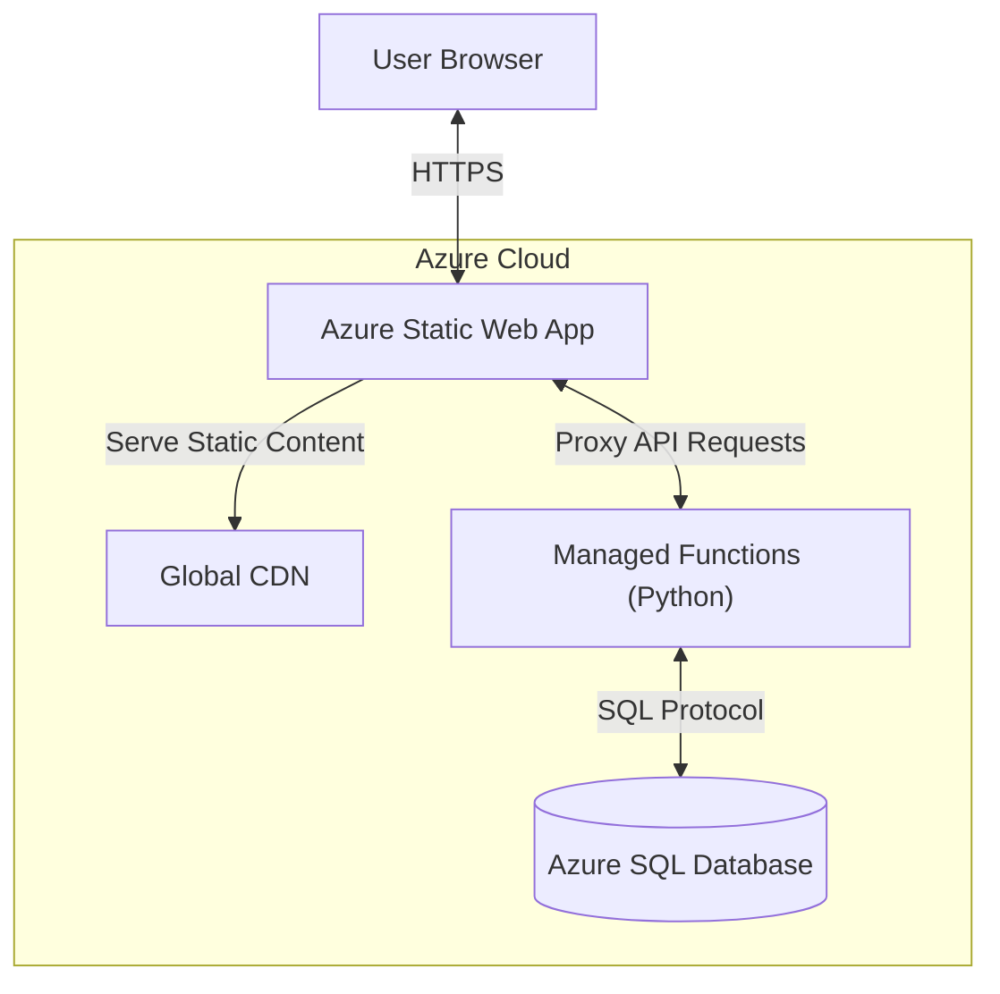

# New Project Initialization Guide

> **TARGET AUDIENCE**: This guide is for an AI Agent or Developer tasked with initializing a new project based on the "Finance App" architecture.
> **OBJECTIVE**: Create a new project structure, scaffold code, and provide manual infrastructure deployment steps.
> **CONSTRAINTS**:
> - **NO** Infrastructure as Code (Terraform/Bicep).
> - **Manual** deployment steps via **Azure Portal** (Click-Ops).
> - **Free Tier** optimization (Azure SQL Serverless + Static Web Apps).
> - **Structure Only**: Do not copy business logic, only the architectural skeleton.

---

## 1. Architecture & Core Concepts

### 1.1 System Architecture Overview

This project uses a **Serverless** architecture optimized for Azure's Free Tier. It leverages **Azure Static Web Apps (SWA)** as the central hub, hosting both the static frontend (Next.js) and the managed backend API (Azure Functions).



### 1.2 Key Components

1.  **Azure Static Web App (SWA)**:
    *   **Frontend**: Serves pre-built static assets (HTML/CSS/JS) from global edge locations.
    *   **Backend (Managed Functions)**: The API is *not* a standalone Azure Functions resource. It is "managed" by the SWA. Azure automatically provisions/deprovisions the functions infrastructure based on demand.
    *   **Routing**: SWA handles routing, directing `/api/*` requests to the backend logic and other requests to the frontend files.

2.  **Azure SQL Database (Serverless)**:
    *   **Compute Model**: Serverless. It automatically pauses after inactivity (e.g., 1 hour) to stop billing, making it free for low-traffic personal apps.
    *   **Connection**: The Python API connects directly via ODBC.

3.  **Deployment Pipeline**:
    *   GitHub Actions automatically builds the Next.js app and the Python API, then packages them for SWA deployment. Changes to `main` trigger production updates; Pull Requests trigger ephemeral preview environments.

---

## 2. Local Project Scaffolding

### 2.1 Directory Structure
Create the following root-level directories:
- `frontend/` (Next.js Application)
- `api/` (Azure Functions Python v2)
- `docs/` (Documentation)
- `scripts/` (Utility scripts)
- `.github/workflows/` (CI/CD - to be populated later)

### 2.2 Frontend Initialization (Next.js)
Initialize the frontend using the specific stack standards.

**Commands:**
```bash
npx create-next-app@latest frontend \
  --typescript \
  --tailwind \
  --eslint \
  --app \
  --src-dir \
  --import-alias "@/*" \
  --use-npm
```

**Post-Init Configuration:**
1.  **Dependencies**: Install `recharts` (standard charting lib).
    ```bash
    cd frontend && npm install recharts
    ```
2.  **`next.config.ts`**: Configure for Static Export (SWA requirement).
    ```typescript
    import type { NextConfig } from "next";

    const nextConfig: NextConfig = {
      output: "export",
      images: { unoptimized: true },
      // Rewrite unnecessary for SWA CLI, but kept for standalone Next.js dev
      async rewrites() {
        return process.env.NODE_ENV === "development" ? [
          { source: "/api/:path*", destination: "http://localhost:7071/api/:path*" }
        ] : [];
      },
    };
    export default nextConfig;
    ```
3.  **`frontend/public/staticwebapp.config.json`**: Create SWA configuration.
    ```json
    {
      "navigationFallback": {
        "rewrite": "/index.html"
      },
      "platform": {
        "apiRuntime": "python:3.11"
      },
      "routes": [
        {
          "route": "/login",
          "rewrite": "/.auth/login/aad"
        },
        {
          "route": "/logout",
          "rewrite": "/.auth/logout"
        }
      ]
    }
    ```

### 2.3 Backend Initialization (Azure Functions)

The backend is a standard **Azure Functions Python v2** project located in the `api/` folder. SWA detects this folder and deploys it as a "Managed Function App".

1.  **Create Files**:
    - `api/requirements.txt`:
      ```text
      azure-functions
      pytest
      pymssql
      ```
    - `api/host.json`:
      ```json
      {
        "version": "2.0",
        "logging": {
          "applicationInsights": {
            "samplingSettings": {
              "isEnabled": true,
              "excludedTypes": "Request"
            }
          }
        },
        "extensionBundle": {
          "id": "Microsoft.Azure.Functions.ExtensionBundle",
          "version": "[4.*, 5.0.0)"
        }
      }
      ```
    - `api/local.settings.json` (Add to .gitignore):
      ```json
      {
        "IsEncrypted": false,
        "Values": {
          "AzureWebJobsStorage": "UseDevelopmentStorage=true",
          "FUNCTIONS_WORKER_RUNTIME": "python",
          "SQL_CONNECTION_STRING": ""
        }
      }
      ```
    - `api/function_app.py` (Skeleton):
      ```python
      import azure.functions as func
      import logging
      import json
      import os

      app = func.FunctionApp()

      @app.route(route="health", methods=["GET"], auth_level=func.AuthLevel.ANONYMOUS)
      def health_check(req: func.HttpRequest) -> func.HttpResponse:
          return func.HttpResponse(
              json.dumps({"status": "ok", "message": "System operational"}),
              status_code=200,
              mimetype="application/json"
          )
      ```

---

## 3. Manual Infrastructure Deployment (Azure Portal)

**Pre-requisites**:
- Azure Account
- GitHub Repository created and code pushed.

### 3.1 Create Resource Group
1.  Search for **Resource groups** in the Azure Portal.
2.  Click **Create**.
3.  **Subscription**: Select your subscription.
4.  **Resource group**: Enter a name (e.g., `my-project-rg`).
5.  **Region**: Select a region (e.g., `East US 2`).
6.  Click **Review + create** -> **Create**.

### 3.2 Create Azure SQL Database (Free Tier)
1.  Search for **SQL databases**.
2.  Click **Create**.
3.  **Resource Group**: Select `my-project-rg`.
4.  **Database name**: Enter a name (e.g., `my-project-db`).
5.  **Server**: Click **Create new**.
    - **Server name**: Enter a unique name.
    - **Location**: Same as Resource Group.
    - **Authentication**: Select **Use SQL authentication**.
    - **Admin login**: `sqladmin`.
    - **Password**: Enter a strong password. **SAVE THIS**.
    - Click **OK**.
6.  **Workload environment**: Development.
7.  **Compute + storage**: Click **Configure database**.
    - **Service usage**: Select **General Purpose**.
    - **Compute tier**: Select **Serverless**.
    - **Hardware configuration**: Change to **Gen5** (if available) or standard defaults.
    - **Data max size**: 32 GB.
    - **Auto-pause**: **Enable**. Delay: **1 hour**.
    - **Free limit exhaustion behavior**: Check **Auto-pause the database until next month**.
    - Click **Apply**.
8.  **Networking** tab:
    - **Firewall rules**: Select **Yes** for "Allow Azure services and resources to access this server".
    - **Add current client IP address**: Select **Yes** (creates firewall rule for your current IP).
9.  Click **Review + create** -> **Create**.

### 3.3 Create Azure Static Web App
1.  Search for **Static Web Apps**.
2.  Click **Create**.
3.  **Resource Group**: Select `my-project-rg`.
4.  **Name**: Enter a name (e.g., `my-project-swa`).
5.  **Plan type**: **Free**.
6.  **Deployment details**: Select **GitHub**.
7.  **Sign-in with GitHub**: Authorize Azure.
8.  **Organization/Repository/Branch**: Select your repo details.
9.  **Build Details**:
    - **Build Presets**: Select **Next.js**.
    - **App location**: `/frontend`
    - **Api location**: `/api`
    - **Output location**: `out`
    - **Api runtime**: `Python 3.11` (Manually type this if unavailable in dropdown, or ensure `staticwebapp.config.json` is present).
10. Click **Review + create** -> **Create**.

### 3.4 Configure Database Connection
1.  Go to your new **SQL Database** resource.
2.  Click **Connection strings** settings.
3.  Copy the **ODBC** connection string.
4.  Replace `{your_password}` with the password you created in 3.2.
5.  Go to your **Static Web App** resource.
6.  Sidebar -> **Environment variables** (or Configuration).
7.  Add:
    - **Name**: `SQL_CONNECTION_STRING`
    - **Value**: <Your connection string>
8.  Click **Add** -> **Save**.

---

## 4. Workflows & CI/CD

### 4.1 How Automation Works (GitHub Actions)
When you created the Static Web App in Step 3.3, Azure automatically committed a workflow file to your repository at `.github/workflows/azure-static-web-apps-<random-name>.yml`.

This workflow handles the entire lifecycle:
1.  **Triggers**: It runs on pushes to `main` (Production deploy) and Pull Requests (Preview deploy).
2.  **Build**: It installs Node dependencies for frontend and Python dependencies for backend, then builds both.
3.  **Deploy**: It uploads the artifacts to Azure Static Web Apps.

**Preview Environments**:
When you open a PR, Azure creates a temporary `staging-<name>` environment with a unique URL. This allows you to test changes in a live environment before merging. Closing the PR automatically deletes this environment.

### 4.2 Critical: Verify Workflow Configuration
After Azure generates the workflow file in `.github/workflows/`, you **MUST** manually verify and update the deployment paths. The default template often mismatches Next.js static export settings.

**The Fix:**
Edit `.github/workflows/azure-static-web-apps-<name>.yml` and ensure the `with` block contains:

```yaml
app_location: "./frontend"
api_location: "./api"      # Often defaults to "" (empty), causing API deployment failure
output_location: "out"     # Default is often "build", but Next.js "export" uses "out"
```

---

## 5. Security & Access Control (Azure AD)

This project uses Azure Static Web Apps' built-in authentication. By default, SWA is public. Follow these steps to restrict access.

### 5.1 Enforcing Authentication (Block Anonymous Traffic)
To block all public access and force users to log in, update `frontend/public/staticwebapp.config.json` to route traffic to the `authenticated` role.

**Method**: Allowed Roles
Update `routes` to restrict the root `/*` to authenticated users only.

```json
{
  "routes": [
    {
      "route": "/*",
      "allowedRoles": ["approved_user"]
    }
  ],
  "responseOverrides": {
    "401": {
      "statusCode": 302,
      "redirect": "/.auth/login/aad"
    }
  }
}
```

### 5.2 Access Models

#### Option A: Open Sign-up (Organization Level)
If you enable Azure Active Directory (AAD) without custom restrictions, **any** user with a Microsoft account (or within your Tenant, depending on AAD app settings) can log in.
- **Config**: Use the `routes` block above.
- **Result**: Anyone who successfully logs in with Microsoft is granted access.

#### Option B: Invite Only (Restricted Access)
To strictly limit access to specific individuals on the **Free Tier**:

1.  **Upgrade Advice**: If possible, use the **Standard Plan** to define Custom Roles (e.g., `member`) and strictly block `authenticated`.
2.  **Free Tier Workaround**:
    - Use the configuration in **5.1** to block anonymous traffic.
    - **In your API (`api/function_app.py`)**, implement a whitelist check.
    - Validate the `x-ms-client-principal-name` (Email) request header against a list of allowed emails. if not allowed, return `403 Forbidden`.

    ```python
    # Example Guard Clause in API
    allowed_users = ["alice@example.com", "bob@example.com"]
    user_id = req.headers.get("x-ms-client-principal-name")
    if user_id not in allowed_users:
        return func.HttpResponse("Unauthorized User", status_code=403)
    ```

3.  **Role Management (Portal)**:
    - Go to Azure Portal -> Static Web App -> **Role Management**.
    - Click **Invite**.
    - Enter email.
    - Domain: (Leave default or select provider).
    - Role: **authenticated** (or custom if Standard).
    - Generate link.
    - *Note*: On Free Tier, you cannot block *other* `authenticated` users at the routing level easily, so the API whitelist is recommended for strictness.

---

## 6. Project Documentation & Agent Guide

Create the following documentation files in your project.

### 6.1 `AGENT_GUIDE.md`
Create this file in the project root. It serves as the Source of Truth for future agents.

```markdown
# AGENT_GUIDE.md

> **CRITICAL**: This file is the Source of Truth for all coding agents working on this project.
> **RULE**: Always read this file before starting complex tasks.

## 1. Tech Stack & Style
- **Framework**: Next.js (App Router) - **Mode**: Static Export (`output: 'export'`)
- **Language**: TypeScript
- **Styling**: Tailwind CSS
- **Deployment**: Azure Static Web Apps (Free Tier Compatible)
- **API**: SWA-managed Azure Functions (Python 3.11 - Model V2) in `api/` folder
  - **Important**: This is NOT a separate Azure Functions resource. The API is deployed as part of the Static Web App via `api_location`.
- **Database**: Azure SQL Database (Serverless Free Tier)
- **Config**: Revenue-neutral: Designed for <$1/month running costs

### Free Tier Constraints
- **SQL Database**: 100K vCore-seconds/month, 32GB storage
- **Auto-Pause**: Database auto-pauses after 60 min inactivity (First request may timeout).
- **Functions**: Consumption plan. Minimize cold starts.

### Style Rules
- **Formatting**: Adhere to ESLint and Prettier.
- **Comments**: MANDATORY JSDoc/TSDoc for exported functions.
- **Cost Efficiency**: Always consider vCore-second usage. Use indexed queries.

## 2. Architecture

### Repository Structure
- `/` - Root (Azure SWA config, Docs)
- `/frontend` - Next.js Application (Client). Builds to `out/`.
- `/api` - SWA-managed Azure Functions (Python).
- `/docs` - Documentation.

### Deployment Flow
GitHub Actions deploys both frontend and API in a single step via the Azure Static Web Apps workflow.
- `app_location`: "/frontend"
- `api_location`: "/api"
- `output_location`: "out"

## 3. Testing Requirements
- **Frontend**: Jest + React Testing Library.
- **API**: Pytest.
- **Rule**: All Logic in API layer MUST have unit tests.

## 4. Database Schema
> **RULE**: Always verify schema changes via migration scripts.

### Query Performance Tips
- Use indexed columns in WHERE clauses.
- Limit results (TOP/OFFSET-FETCH).
- Avoid `SELECT *`.

## 5. Local Development
- **Frontend**: `cd frontend && npm run dev`
- **Backend**: `cd api && func start`
- **Full Stack**: Use SWA CLI `swa start` or run independently.

## 6. Environment Variables
| Variable | Description |
|----------|-------------|
| `SQL_CONNECTION_STRING` | ODBC connection string for Azure SQL |
```

### 6.2 "Getting Started" Section (for README.md)

Include these instructions in your project's `README.md` to guide new developers.

#### Local Development Setup

To run a production-like local environment with auth simulation:

**Terminal 1 (Frontend)**:
```bash
cd frontend
npm install
npm run dev   
```

**Terminal 2 (SWA Emulator)**:
```bash
# Requires SWA CLI: npm install -g @azure/static-web-apps-cli
# Starts the emulator, proxying requests to frontend (port 3000) and running the API (auto-detected)
swa start http://localhost:3000 --api-location ./api
```

Access the app at `http://localhost:4280`. This provides:
- Frontend at correct URL
- API available at `/api/*`
- Authentication emulation at `/.auth/*`

#### Prerequisites
*   Node.js v20+
*   Python v3.11+
*   Azure Functions Core Tools v4 (`npm install -g azure-functions-core-tools@4`)
*   SWA CLI (`npm install -g @azure/static-web-apps-cli`)
